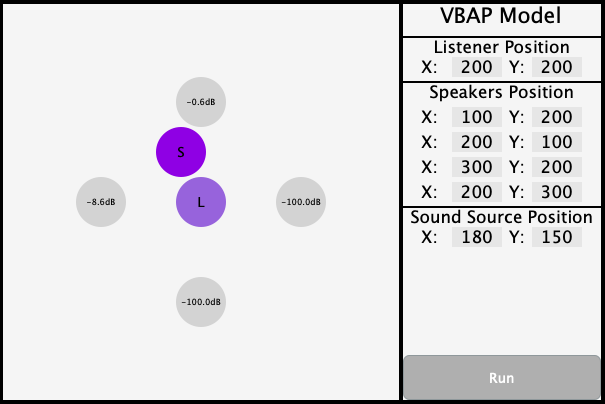

# Spacial-Audio App

Introduction

An GUI application built with JUCE framework which calculates the dBFS of 4 surrounded speakers to simulate the virtual sound source in the room.

The user can adjust the positions of the listener, speakers and supposed virtual sound source to calculate the volume outputs of the 4 speakers.

## Compile the Project

A simple way to compile the project:

1. Download the latest version of the Juce Framework.

   https://shop.juce.com/get-juce/download

2. download the project or simply using the git clone command in the console:``

   `git clone https://github.com/Silver92/Spacial-Audio.git`

3. Open the projucer in the Juce Framework folder then select the open button in the File panel, or select the "Open Existing Project" in the New Project guiding panel.

   

4. Find the directory of the project and select the ".jucer" file

5. Selected the exporter for the project based on the OS and click "save and open in IDE" button on the right side

   

## Other Questions

The project is developed and tested under the Mac + Xcode environment. Users who compile in Windows OS may have following problems:

1. There may be some lost path of the JUCE models

   Select the "..." button on the right side of the "path to JUCE" or "JUCE Modules" panel to locate the folder of the downloaded framework

2. Under Windows OS the users need to download VST3 SDK and add the path to the juce client app in order to export the correct format of audio plugin.

   VST3 SDK link:

   https://www.steinberg.net/en/company/developers.html

   

For mor information about the juce setup, please see the tutorials below:

https://docs.juce.com/master/tutorial_new_projucer_project.html

https://docs.juce.com/master/tutorial_manage_projucer_project.html

